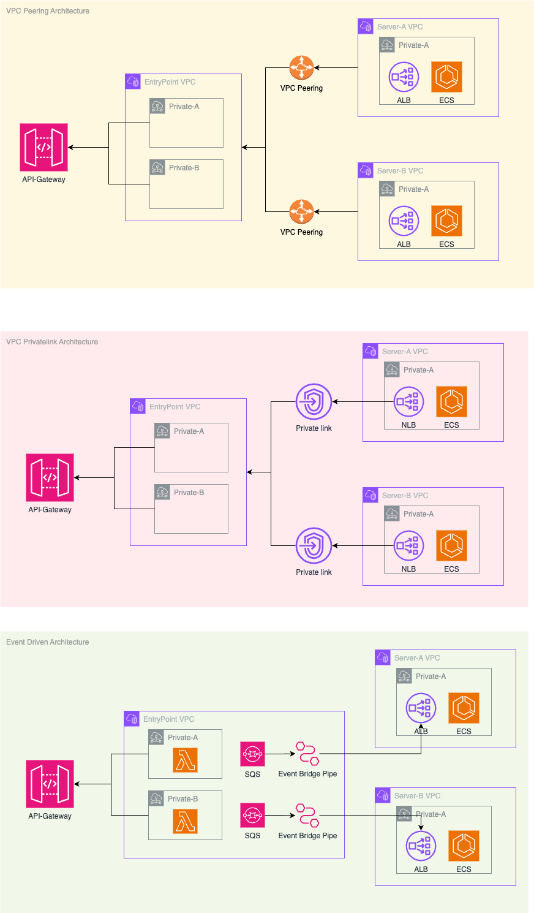

# 폐쇄망 전략

## Rule

- Public Subnet 없음 (EntryPoint-VPC 만 존재함)
- Private Subnet으로만 구성

## Private Subnet 내 구성되어있는 EC2 SSM 접근하기 (완료)

- ssm 관련 endpoint를 구성해야 함
- ssm endpoint sg를 추가하는것을 잊지말자... ( 필요하다면 EC2 Instance Connect Endpoint 구성하자)

## API-Gateway가 Private Subnet에 통신하는 방법 (VPC Link) (완료)

## API-Gateway 에서 통신하는 방법

## Private link 구성 하는 법

- NLB를 미리 구성해놓자...

- 다른 VPC에서 vpc endpoint를 사용하자

